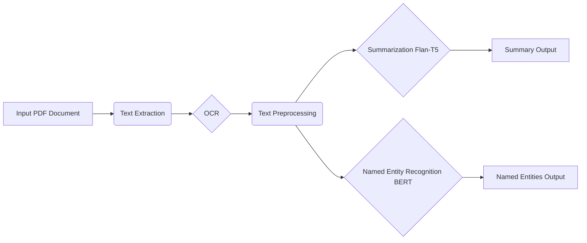

# Legal Document Analysis - Unleashing the Power of AI on Legal Text

## Workflow

Here's a visual representation of the workflow:


## Live Demo

Try out the Legal Document Summarization model with our interactive demo hosted on Hugging Face Spaces:

[](https://shresthasingh-legal-doc-summarization.hf.space)


## Dive into the World of Automated Legal Insights!

This repository empowers you to effortlessly analyze legal documents using the cutting-edge capabilities of Natural Language Processing (NLP).  Say goodbye to tedious manual reviews and unlock valuable insights hidden within complex legal text.

**Imagine:**

* **Effortlessly summarizing lengthy legal documents** to grasp key information in minutes.
* **Instantly identifying crucial entities** like individuals, organizations, and locations mentioned in the text.
* **Extracting key information** to streamline your legal research and decision-making process.

**This repository provides the tools you need to:**

* **Summarize Legal Documents:** Condense lengthy legal texts into concise summaries using a fine-tuned Flan-T5 model.
* **Extract Named Entities:** Identify and categorize key entities like people, organizations, and locations with a powerful BERT-based NER model.
* **Analyze Text from PDFs:** Extract text from PDF documents, including OCR capabilities for scanned documents.

## Key Features:

* **State-of-the-art NLP Models:**  Leverages pre-trained and fine-tuned models for superior performance.
* **Easy-to-Use Interface:**  Clear and concise code makes it simple to integrate into your workflow.
* **Customizable:**  Adjust parameters to fine-tune the analysis to your specific needs.
* **Comprehensive Analysis:** Provides both summaries and detailed entity extraction for a holistic understanding.

## Getting Started:

1. **Clone the Repository:**
   ```bash
   git clone https://github.com/shresthasingh1501/legal_document_analysis.git
   ```

2. **Install Dependencies:**
   ```bash
   pip install -r requirements.txt
   ```

3. **Explore the Code:**

   * **Fine-tuning Code:**
      * **BERT for NER:**  Find the code for fine-tuning the BERT model for Named Entity Recognition in the `notebooks/Entity_ExtractionUsing_BERT_&_PyTorch_finetune.ipynb` notebook.
      * **Flan-T5 for Summarization:**  Explore the code for fine-tuning the Flan-T5 model for summarization in the `notebooks/FlanT5-Summerizer.ipynb` notebook.

   * **Core Analysis Scripts:**
      * **`analysis.py`:**  This script provides the core functionality for processing PDF documents, summarizing text, and extracting named entities.
      * **`bert-ocr.py`:**  This script enhances text extraction by incorporating OCR capabilities for scanned PDF documents.

4. **Test with Sample PDFs:**
   * Place your sample PDF documents in the `samplepdfs` directory.
   * Modify the scripts to point to the correct directory and run them to see the magic in action!

## Where to Find What:

* **`code/`:** Contains the Python scripts for analysis.
* **`notebooks/`:** Jupyter notebooks for fine-tuning models.
* **`readme.md`:** This informative guide!
* **`requirements.txt`:**  List of project dependencies.
* **`samplepdfs/`:**  A directory to store your sample PDF files.
* **`streamlit-ui.py`:** (Optional) A Streamlit-based UI for interactive analysis (implementation in progress).


## Unleash the Power of AI on Your Legal Documents Today!

This repository provides a powerful toolkit for automating legal document analysis. Start exploring and discover the insights waiting to be uncovered!

**Contributions are welcome!**  Feel free to open issues, suggest improvements, or submit pull requests.  Let's build a better future for legal analysis together.

**Disclaimer:** This repository is for educational and research purposes.  It is not intended to provide legal advice.
